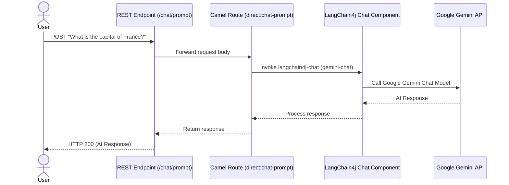

# 💬 Camel LangChain4j Chat with Gemini

This example demonstrates how to integrate **Apache Camel** with **LangChain4j's Chat Component** and **Google Gemini** within the **Camel Dashboard**. It exposes a REST API that forwards user prompts directly to the Gemini Chat model for completion.

---

## 🏗️ Architecture & Flow



---

## ⚙️ Prerequisites & Setup

### 1. Get a Gemini API Key
To use the Google Gemini model, you need an API key from [Google AI Studio](https://aistudio.google.com/).

### 2. Configure Environment Properties in Camel Dashboard
Define the following environment variables or properties:

| Property Name | Example Value | Description |
|---|---|---|
| `GEMINI_API_KEY` | `AIzaSyD...` | Your Gemini API Key |
| `GEMINI_MODEL_FLASH_LITE` | `gemini-3-flash-preview` | The Gemini model name to use |

---

## 📦 Dependency & Classpath Setup

Because this example dynamically registers a `GoogleAiGeminiChatModel` bean (which belongs to the third-party LangChain4j library `langchain4j-google-ai-gemini`), the class files must be available on the Camel Dashboard JVM classpath.

Choose **one** of the options below depending on how you are running the application:

### Option A: Local Development Mode (Running via `mvnw spring-boot:run`)
If you are running the backend in development mode, the simplest way to add the dependencies is to declare them in the main [`pom.xml`](../../pom.xml):

1. Open [`pom.xml`](../../pom.xml) at the project root.
2. Add the following dependencies under `<dependencies>`:
   ```xml
   <dependency>
       <groupId>dev.langchain4j</groupId>
       <artifactId>langchain4j-google-ai-gemini</artifactId>
       <version>1.16.1</version>
   </dependency>
   <dependency>
       <groupId>org.apache.camel.springboot</groupId>
       <artifactId>camel-langchain4j-chat-starter</artifactId>
   </dependency>
   ```
3. Restart your backend application.

---

### Option B: Production / Standalone Mode (Jar/Docker)
If you are running the packaged Camel Dashboard JAR, dependencies are loaded dynamically from the configured loader path (default is `./libs`):

1. Download the following Maven artifacts (and their dependencies) and copy them into the `./libs` directory at the project root:
   - `dev.langchain4j:langchain4j-google-ai-gemini:1.16.1`
   - `org.apache.camel:camel-langchain4j-chat:4.20.0`
   - `org.apache.camel:camel-langchain4j-chat-api:4.20.0`

2. Alternatively, you can use the Maven dependency plugin to download and place them into the `./libs` directory:
   ```bash
   mvn dependency:copy -Dartifact=dev.langchain4j:langchain4j-google-ai-gemini:1.16.1:jar -DoutputDirectory=./libs
   mvn dependency:copy -Dartifact=org.apache.camel:camel-langchain4j-chat:4.20.0:jar -DoutputDirectory=./libs
   mvn dependency:copy -Dartifact=org.apache.camel:camel-langchain4j-chat-api:4.20.0:jar -DoutputDirectory=./libs
   ```

3. Restart the Camel Dashboard backend.

> [!NOTE]
> Camel Dashboard dynamically scans the deployed route. It will automatically attempt to resolve the Camel component scheme `langchain4j-chat` if missing. However, third-party model libraries like `langchain4j-google-ai-gemini` must be staged manually.

## 🚀 Deploy the Route

1. Open the Camel Dashboard UI (`http://localhost:8080`).
2. Navigate to **Services** and create a new service called `Langchain4j Chat`.
3. Go to **Upload**, upload the [`langchain4j-chat.camel.yaml`](./langchain4j-chat.camel.yaml) file, and assign it to the `Langchain4j Chat` service.
4. Click **Deploy & Start** to run the route.

---

## 🧪 Testing the Endpoint

Submit a POST request with the prompt text:

```bash
curl -X POST http://localhost:8080/cameldash/chat/prompt \
  -H "Content-Type: text/plain" \
  -d "What is the capital of France?"
```

### Expected Output:
```text
The capital of France is Paris.
```
