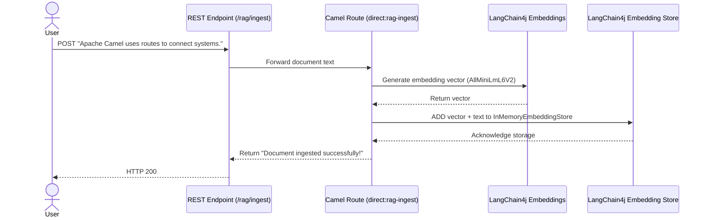
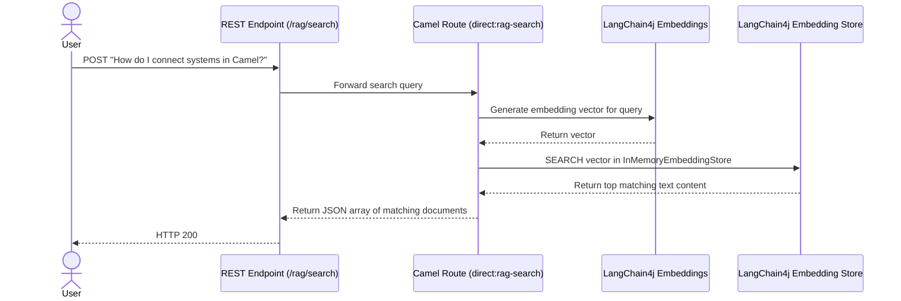

# 🗄️ LangChain4j RAG (Vector Ingestion & Search) with Camel

This example demonstrates how to implement a local, self-contained **Retrieval-Augmented Generation (RAG)** ingestion and lookup pipeline using **Apache Camel** and **LangChain4j**. It sets up an in-memory vector store, generates embeddings using a local ONNX model, and allows you to ingest text documents and search for matching segments.

---

## 🏗️ Architecture & Flow

### 1. Ingestion Flow (`/rag/ingest`)


### 2. Search Flow (`/rag/search`)


---

## ⚙️ Prerequisites & Setup

### 1. Get a Gemini API Key
To use the Google Gemini embedding model, you need an API key from [Google AI Studio](https://aistudio.google.com/).

### 2. Configure Environment Properties in Camel Dashboard
Define the following environment variable or property:

| Property Name | Example Value | Description |
|---|---|---|
| `GEMINI_API_KEY` | `AIzaSyD...` | Your Gemini API Key |

---

## 📦 Dependency & Classpath Setup

This route uses a **modeline** (`#camel-dashboard:dependency=...`) at the top of the file to declare its required libraries:
* `dev.langchain4j:langchain4j-google-ai-gemini`
* `org.apache.camel:camel-langchain4j-embeddings`
* `org.apache.camel:camel-langchain4j-embeddingstore`

When you upload the route file in the Camel Dashboard, the backend will automatically scan, resolve, and download these dependencies into the `./libs` directory. 

After uploading, you will see a status notification in the dashboard:
> `missing components downloaded — restart required`

Simply **restart the Camel Dashboard application** (or restart the docker container if running in docker) to complete the setup and start the route.

---

## 🚀 Deploy the Route

1. Open the Camel Dashboard UI (`http://localhost:8080`).
2. Navigate to **Services** and create a new service called `Langchain4j RAG`.
3. Go to **Upload**, upload the [`langchain4j-rag.camel.yaml`](./langchain4j-rag.camel.yaml) file, and assign it to the `Langchain4j RAG` service.
4. Click **Deploy & Start** to run the route.

---

## 🧪 Testing the Endpoint

### 1. Ingest Documents
Submit several document segments to build your vector database knowledge base:

```bash
# Ingest document 1
curl -X POST http://localhost:8080/cameldash/rag/ingest \
  -H "Content-Type: text/plain" \
  -d "Apache Camel is an open source integration framework based on Enterprise Integration Patterns (EIP)."

# Ingest document 2
curl -X POST http://localhost:8080/cameldash/rag/ingest \
  -H "Content-Type: text/plain" \
  -d "Kubernetes is a container orchestration tool that automates deployment and scaling of applications."
```

### 2. Search the Vector Database
Query the database with a question to retrieve matching context:

```bash
curl -X POST http://localhost:8080/cameldash/rag/search \
  -H "Content-Type: text/plain" \
  -d "What is Apache Camel?"
```

#### Expected Output:
```json
[
    {
        "score": 0.9105002103127195,
        "text": "Kubernetes is a container orchestration tool that automates deployment and scaling of applications."
    },
    {
        "score": 0.7649789598222618,
        "text": "Apache Camel is an open source integration framework based on Enterprise Integration Patterns (EIP)."
    }
]
```
Notice that it successfully retrieved the document relevant to "Apache Camel" and did not return the irrelevant document about Kubernetes!
