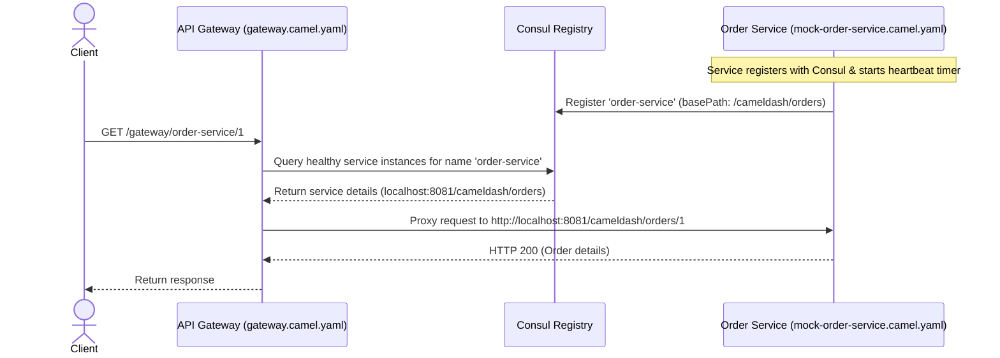

# 🌉 API Gateway & Service Discovery with Consul

This example demonstrates how to build an **API Gateway** pattern using **Apache Camel** and **HashiCorp Consul** as a dynamic service registry. It routes incoming gateway traffic to active mock microservices based on service instance lookup data retrieved from Consul.

---

## 🏗️ Architecture & Flow



---

## ⚙️ Prerequisites & Setup

### 1. Run HashiCorp Consul

This example requires Consul to be running. We will use the `hashicorp/consul:2.0` image:

#### Option A: Docker Run Command
```bash
docker run -d \
  --name consul \
  -p 8500:8500 \
  hashicorp/consul:2.0
```

#### Option B: Docker Compose
Create a `docker-compose.yml` file and run `docker compose up -d`:
```yaml
version: '3.8'
services:
  consul:
    image: hashicorp/consul:2.0
    container_name: consul
    ports:
      - "8500:8500"
```

> [!IMPORTANT]
> The YAML route definitions in this example contact Consul via the address `host.docker.internal:8500`.

### 2. Register Consul Prepared Query Template

We use Consul's **Prepared Query** feature to perform dynamic service discovery with prefix-matching support.

Register the prepared query template by executing the following command from the `examples/gateway` directory:

```bash
curl -X POST \
  -H "Content-Type: application/json" \
  -d @prepared_query_template.json \
  http://localhost:8500/v1/query
```

This registers a template with prefix `gateway-` of type `name_prefix_match`. When the gateway makes a request to `http://localhost:8500/v1/query/gateway-<service-name>/execute`, Consul automatically extracts the suffix (`<service-name>`) and resolves it to the corresponding passing instances.

---

## 📦 Service Configuration & Properties

The mock service and gateway use dynamic properties. Ensure the following environment properties are declared in the Camel Dashboard properties page (under the Environment Properties tab) or your properties file:

| Property Name | Default Value | Description |
| :--- | :--- | :--- |
| `consul.address` | `host.docker.internal:8500` | Address of the HashiCorp Consul agent |
| `order-service.host` | `host.docker.internal` | Hostname/address that the mock order service registers itself with under Consul |

---

## 🚀 Running the Example

### Step 1: Start Camel Dashboard
Make sure the **Camel Dashboard** application is running first. You can run it locally or via Docker (refer to the root [README.md](../../README.md) for startup instructions). Once started, the dashboard UI is available at `http://localhost:8081/cameldash`.

### Step 2: Deploy the Mock Service
1. Open the Camel Dashboard UI at `http://localhost:8081/cameldash`.
2. Click **Create Service** and name it `mock-order-service`.
3. Open the `mock-order-service` service, click **Upload Version**, and upload the [`mock-order-service.camel.yaml`](./mock-order-service.camel.yaml) route.
4. Click **Deploy & Start** to start the service.
5. Upon startup, this service registers itself (`order-service`) with Consul and initiates a heartbeat timer every 20 seconds.

### Step 3: Deploy the Gateway
1. In the Camel Dashboard UI, click **Create Service** and name it `gateway` (or `api-gateway`).
2. Open the `gateway` service, click **Upload Version**, and upload the [`gateway.camel.yaml`](./gateway.camel.yaml) route.
3. Click **Deploy & Start** to start the gateway.
4. The Gateway is now running and listening on the `/gateway` path (e.g., `http://localhost:8081/gateway/*`).

### Step 4: Verify Consul Registration
Open the Consul UI at [http://localhost:8500](http://localhost:8500) to confirm the `order-service` instance is successfully registered and passing health checks.

---

## 🧪 Testing the API Gateway

Once the service is running and registered in Consul, route calls through the gateway.

### 1. Test Order Service Routing
Run the following request to fetch order details:
```bash
curl -X GET http://localhost:8081/gateway/order-service/1
```
**Expected Output:**
```text
HTTP 200 OK
```

### 2. Test Offline / Missing Service Routing
Request a service that does not exist or has been stopped:
```bash
curl -X GET http://localhost:8081/gateway/unknown-service/1
```
**Expected Output:**
```json
{
  "error": "Service not found or offline"
}
```
*(HTTP Status: `404 Not Found`)*
