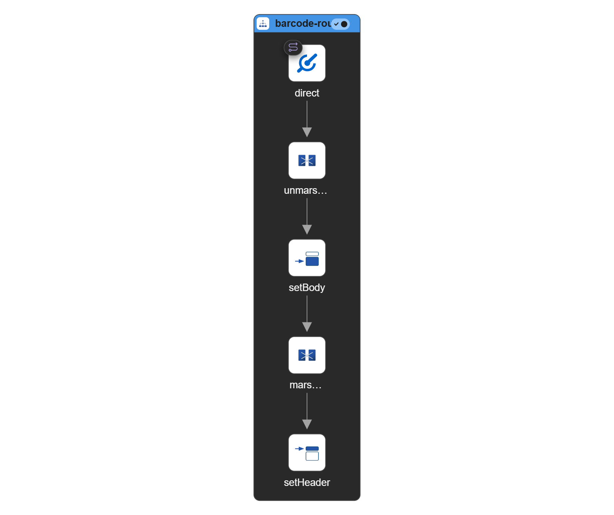

# Diagram

# barcode-route

| Step ID | Step      | URI             | Parameter Name        | Value         |
| ------- | --------- | --------------- | --------------------- | ------------- |
|         | from      | direct:generate |                       |               |
|         | unmarshal |                 |                       |               |
|         | setBody   |                 | simple                | ${body[data]} |
|         | marshal   |                 | barcode.barcodeFormat | QR_CODE       |
|         |           |                 | barcode.imageType     | PNG           |
|         |           |                 | barcode.width         | 100           |
|         |           |                 | barcode.height        | 100           |
|         | setHeader |                 | name                  | Content-Type  |
|         |           |                 | constant              | image/png     |

# rest-5014 [Path : /barcode]

| Method | ID           | Path | Route           |
| ------ | ------------ | ---- | --------------- |
| POST   | post-barcode |      | direct:generate |

