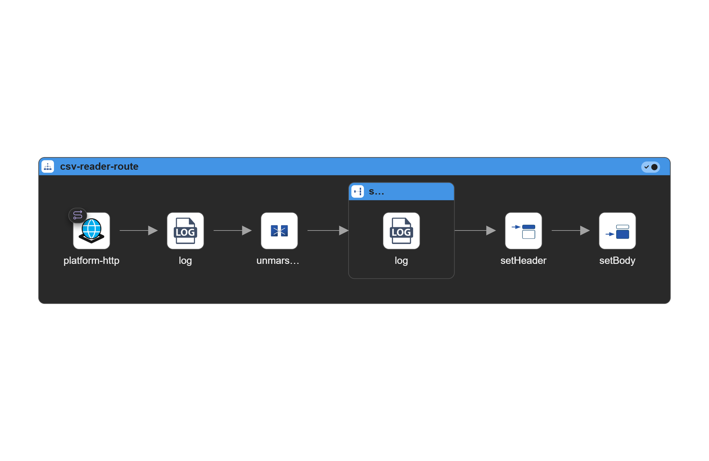

# Diagram

# csv-reader-route

| Step ID                | Step      | URI                         | Parameter Name      | Value                                                                                                 |
| ---------------------- | --------- | --------------------------- | ------------------- | ----------------------------------------------------------------------------------------------------- |
|                        | from      | platform-http               | path                | /csv                                                                                                  |
|                        |           |                             | httpMethodRestrict  | POST                                                                                                  |
|                        | log       | Received CSV upload request |                     |                                                                                                       |
| unmarshalCsv           | unmarshal |                             |                     |                                                                                                       |
| splitCsvRows           | split     |                             | simple              | ${body}                                                                                               |
|                        | log       | CSV Row: ${body}            |                     |                                                                                                       |
| setResponseContentType | setHeader |                             | name                | Content-Type                                                                                          |
|                        |           |                             | constant.expression | application/json                                                                                      |
| setResponseJson        | setBody   |                             | simple              | {&#10;  "status": "success",&#10;  "message": "CSV file processed and logged successfully"&#10;}&#10; |

