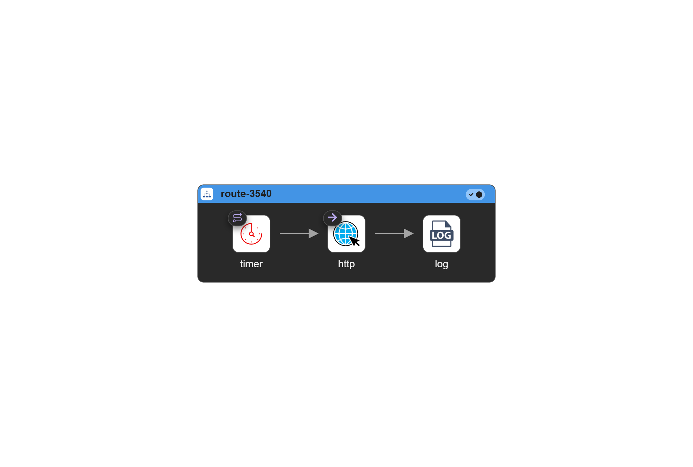

# Diagram

# route-3540

| Step ID   | Step | URI   | Parameter Name | Value                                        |
| --------- | ---- | ----- | -------------- | -------------------------------------------- |
| from-9164 | from | timer | period         | 1000                                         |
|           |      |       | timerName      | template                                     |
|           |      |       | repeatCount    | 10                                           |
| to-2695   | to   | http  | httpUri        | https://jsonplaceholder.typicode.com/posts/1 |
| log-1724  | log  |       | message        | ${body}                                      |

